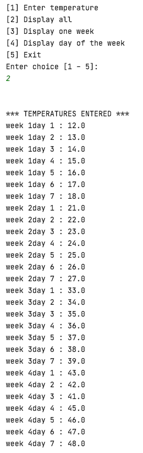

# Monthly Temperature Project

This is a console-based Java application, designed to take 4 weeks of daily temperatures 
and display the data either weekly or daily.

## Installation: 

Download or clone the repository on your local machine.

```sh
$ git clone https://github.com/AAdewunmi/Monthly_Temperatures.git
$ cd Monthly_Temperatures
```
### Console output 
```sh
* 4 week temperatures 

```
```sh
* 1 week / 1 day temperatures 

```
